ФИО: Пелих Дмитрий Александрович
Группа: Б9123-09.03.03

Выбранный API:
PokeAPI (https://pokeapi.co/)
Тот же проект, что и в ДЗ №4–6 (список покемонов на PokeAPI). В финальной работе развит до персонализированного offline-first mini-product.

Что добавлено в финальной работе:

+ Локальные профили пользователей без сервера — все данные привязаны к активному профилю, изоляция между трейнерами.
+ Команды (teams) — до 6 покемонов в команде, заметка к слоту, reorder.
+ Пользовательские теги (many-to-many) с цветом, фильтрация списка по тегам.
+ Личные заметки на покемона.
+ Сохранённые пресеты фильтров (поиск + favorites + теги в один чип).
+ Offline-first кэш покемонов с TTL — UI читает только из Room, сеть для обновления.
+ Settings с DataStore — тема, TTL кэша, интервал sync, Wi-Fi only, ручной Sync now.
+ Bottom-nav: Pokedex / Teams / Tags / Settings. Profiles — гейт-экран.
+ WorkManager: периодический SyncCachedPokemonWorker + одноразовый PrefetchGen1Worker.

Новые сущности (Room v2):

profiles, pokemon_cache, pokemon_list_cache, favorites, history, teams, team_slots, tags, pokemon_tag_cross_ref, notes, filter_presets. FK CASCADE по профилям/командам/тегам. JSON-снимок схемы экспортируется в app/schemas/.

Чеклист требований ТЗ:

+ Базовый проект из ДЗ №4–6 рабочий: список, деталка, навигация, сеть, Room, реактивный UI.
+ Экран настроек (DataStore) — Settings tab.
+ Экран истории — History (через TopBar в Pokedex).
+ Отдельный пользовательский раздел: профили + команды + теги + заметки + пресеты.
+ 8 законченных сценариев (минимум 3 + 2 существенных + 1 с новой связью).
+ Новые сущности и M:N связь: TeamEntity+TeamSlotEntity, TagEntity+PokemonTagCrossRef.
+ DataStore — только настройки (тема, TTL, sync interval, активный профиль и т.д.).
+ Room — пользовательские данные, история, кэш, связи между сущностями.
+ Offline-first: UI читает Room, сеть для обновления по TTL, graceful degradation на IOException.
+ WorkManager: periodic sync + one-time prefetch + manual Sync now.
+ Тесты: бизнес-логика (TTL, slot-cap, M:N), реактивная (Turbine), background (Worker).

Стек:

AGP 8.5, Gradle 8.7, Kotlin 1.9.22, Compose BOM 2023.08.00, Hilt 2.50, Room 2.6.1, DataStore 1.0.0, WorkManager 2.9.0, Retrofit 2.9.0, Coil 2.5.0, Turbine 1.0.0, MockK 1.13.8.

Скриншоты:

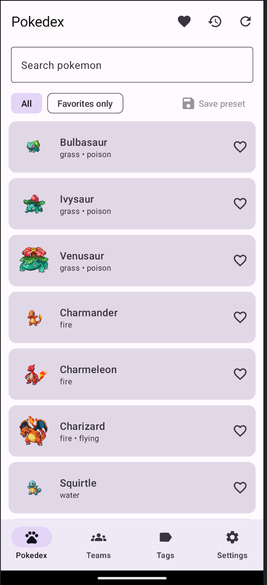
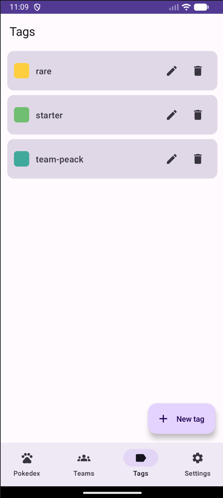
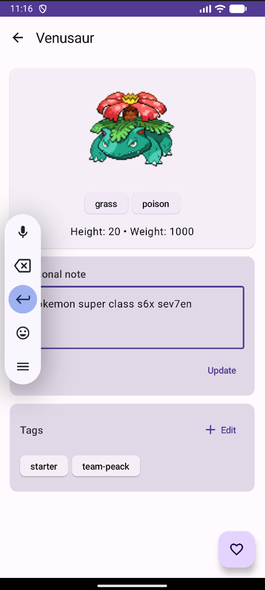
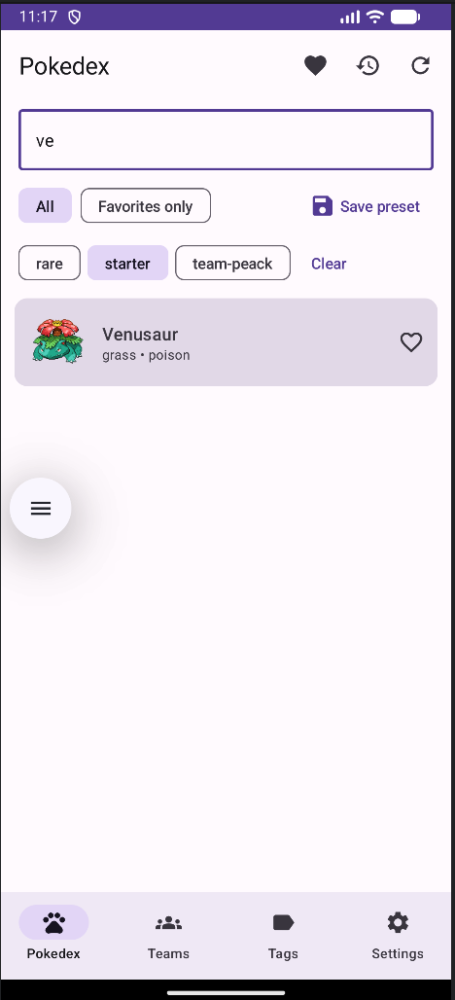
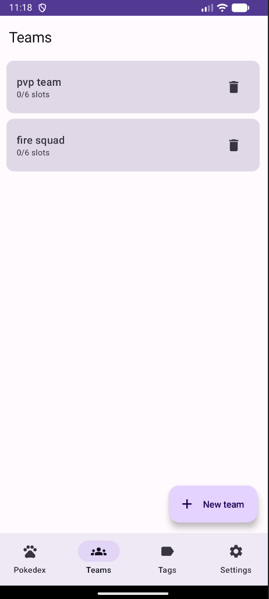
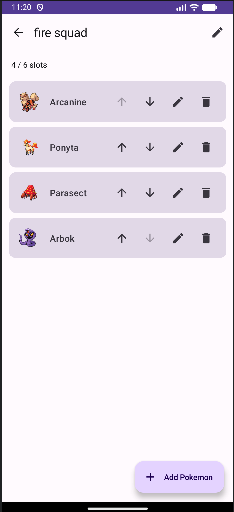
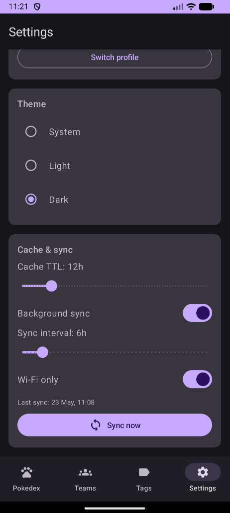
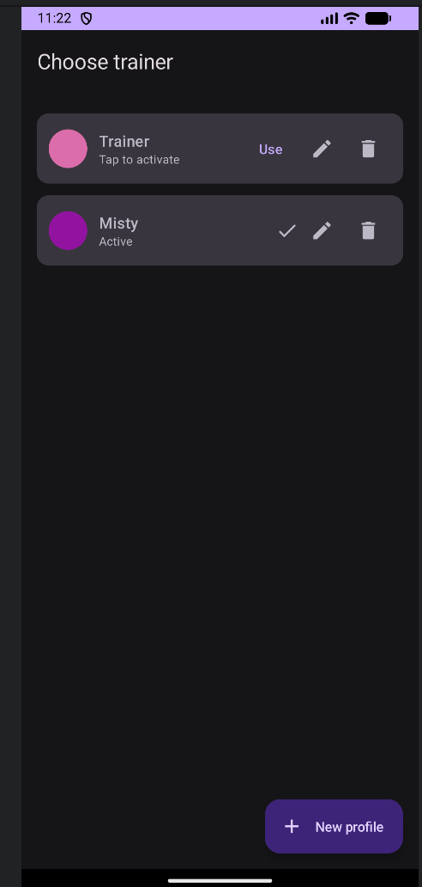

WorkManager Inspector — periodic worker с UNMETERED constraint из DataStore:
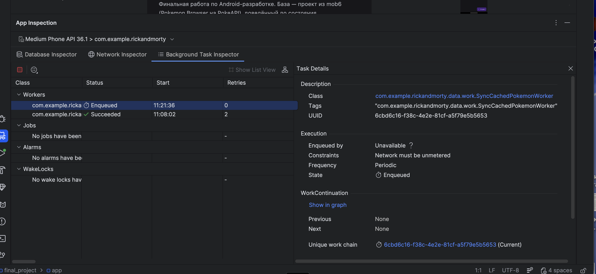

Database Inspector — 2 строки в profiles (Trainer и Misty с разными avatarSeed):
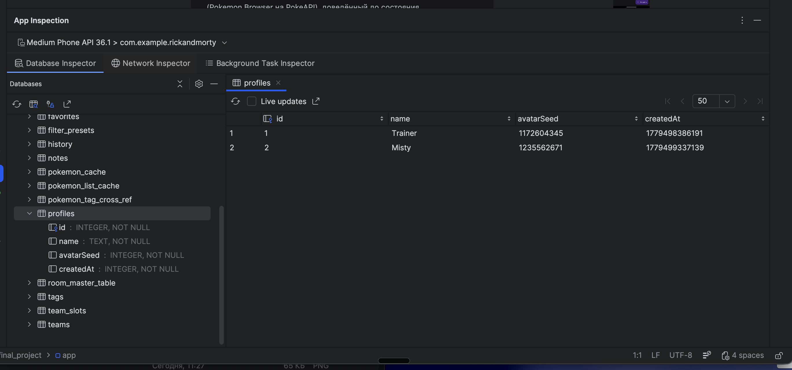

Тесты — BUILD SUCCESSFUL:
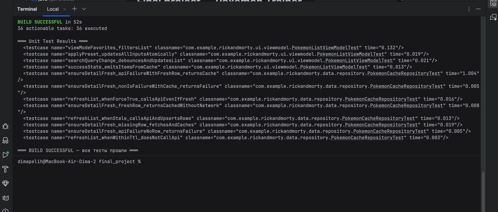
